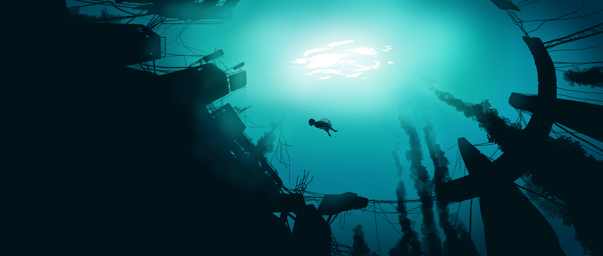

## `Hi there! 👋🏻`

### I'm Lacrimae. While Java is my primary language of choice, I have a deep passion for coding, and I'm always eager to explore and master new technologies.

## `Reaching me out`

> If you have any questions feel free to contact me at
> discord [click here](https://discordapp.com/users/1076499602313838592) (Lacrimae#7425) or via
> email <a href="lacrimae.me@gmail.com" target="_blank">lacrimae.me@gmail.com</a> 

You might find https://sentientexistense.github.io/ to be of interest!

## `🌱 I'm currently learning/working on`

- Developing a strong foundation in **CS** by studying **data structures** and **algorithms** on LeetCode.
- Studying **system** and **low-level** design to enhance my understanding of software architecture and design
  principles.
- Learning about NoSQL databases and applying my knowledge to develop a microservice architecture with **Redis**.
- Building a microservices-based chat application called `Chatastic` that operates in real-time.
